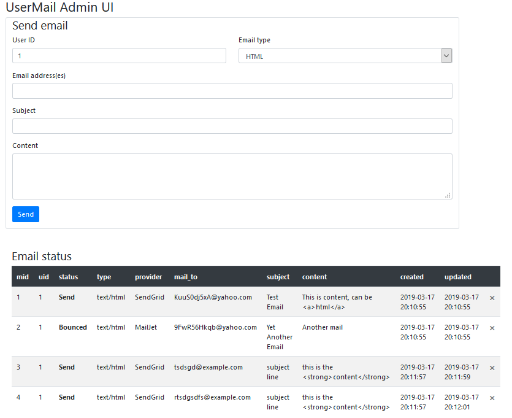

# email-transaction-microservice

- Although I thought redis might be a good option with regards to storing mail state, mysql prebuild docker setup are ready to go hence quicker
- Rather than use a single Docker images for it all, separate out mysql from the php/nginx containers for scalability 
- Aim to include a few of the nice-to-haves from the start to ensure I account for them when building as it's much harder to get them in later.
- Keep Vue.js application as simple as possible unless/till there's time to make it nicer as it's a nice-to-have
- Use PUT rather than POST for creating a new mail, as repeatedly submitting the same information should not result in multiples

## Running the service
On a docker enabled host, run from inside the root dir of the repo

    docker-compose up

You'll need to create a .env file first based on the .env.example file with environment details

Then, inside the lumen directory of the project run
  

    php artisan migrate:fresh && php artisan db:seed && php artisan queue::work

This will set up the database tables and add some sample data, and start the queue worker

To run unit tests, after resetting the database using the above command, enter

    phpunit

To use from CLI

    php artistan usermail:get <uid> [<mid>]

    php artistan usermail:put <uid> <mtid> <mail_to> <content> <subject> [<mid>]

    php artistan usermail:delete <uid> [<mid>]

The Vue.js UI should be reachable on {site_domain}:8081
With it you can also view, update and delete mails.

